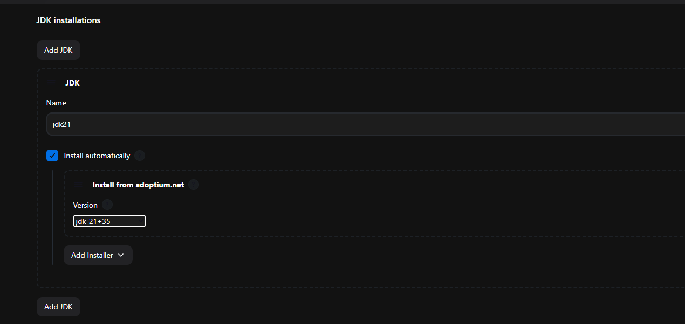
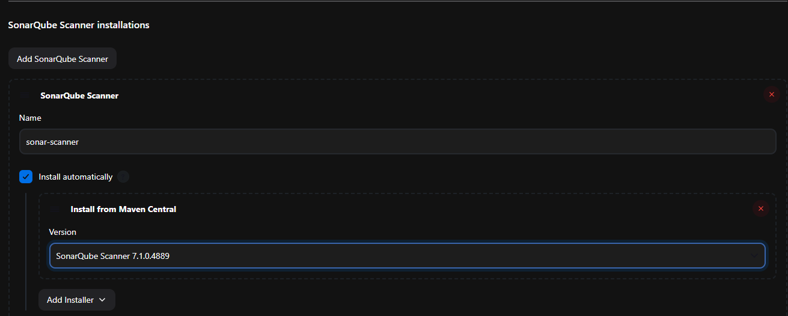
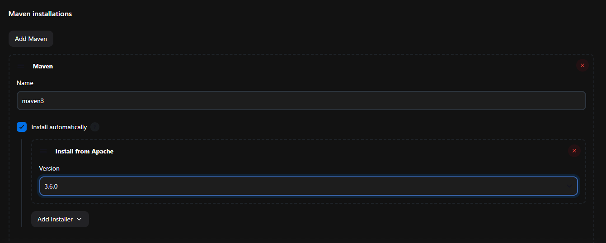
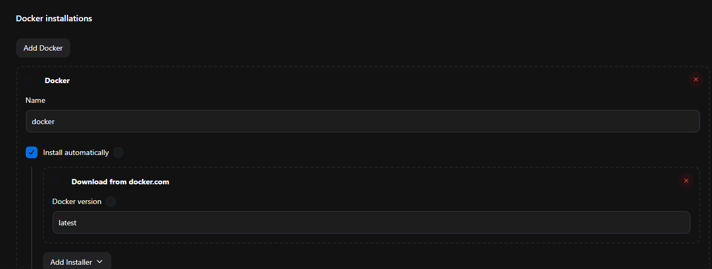
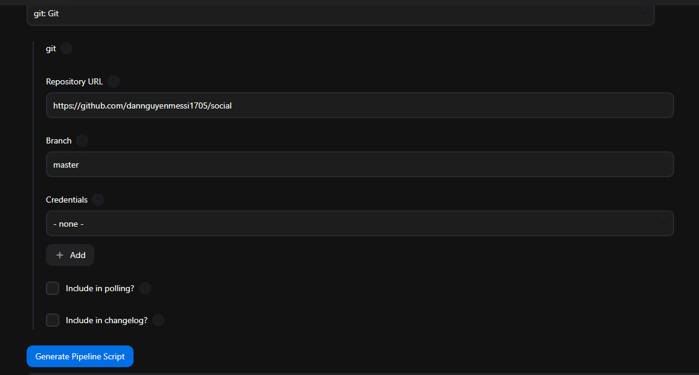
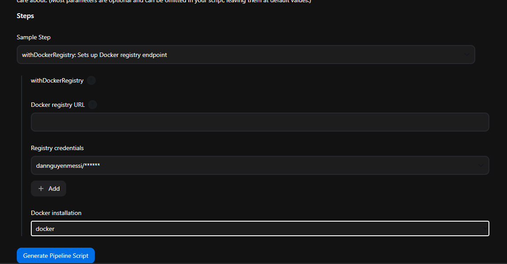

# Jenkins Deploy CI/CD
## 1. Giới thiệu
Jenkins là một công cụ tự động hóa mã nguồn mở, giúp tự động hóa quy trình phát triển phần mềm. Nó hỗ trợ tích hợp liên tục (CI) và triển khai liên tục (CD), cho phép các nhóm phát triển xây dựng, kiểm tra và triển khai ứng dụng một cách nhanh chóng và hiệu quả.

## 2. Cài đặt Jenkins
Để cài đặt Jenkins, bạn có thể làm theo các bước sau:
1. Chuẩn bị file Dockerfile cho Jenkins để cài đặt Docker và Maven trước khi chạy Jenkins.
```dockerfile
FROM jenkins/jenkins:lts

## Chạy Jenkins với quyền root (để cài đặt Docker và Maven)
USER root 

## Cài đặt Maven
RUN apt-get update && apt-get install -y maven

## Cài đặt Docker
RUN apt-get update && \
    apt-get install -y \
    ca-certificates \
    curl \
    sudo && \
    curl -fsSL https://get.docker.com -o install-docker.sh && \
    sudo sh install-docker.sh && \
    sudo usermod -a -G docker jenkins
```

2. Sử dụng docker-compose để khởi động Jenkins, SonarQube và các services cần thiết.
```yaml
services:
  jenkins: # Jenkins service
    build:  # Lệnh để build Jenkins image từ Dockerfile
      context: . # Đường dẫn đến thư mục chứa Dockerfile
      dockerfile: Dockerfile # Tên file
    container_name: jenkins-container # Tên container
    ports: 
      - "8088:8080" # Jenkins web UI port
      - "50000:50000" # Jenkins agent port
    volumes:
      - ./data/jenkins:/var/jenkins_home # Mount các cấu hình của Jenkins
      - //var/run/docker.sock:/var/run/docker.sock # Mount Docker socket để Jenkins có thể chạy Docker commands
    networks:
      - jenkinsnet # Tên mạng cho các services
    environment:
      JENKINS_OPTS: --httpPort=8080 # Jenkins HTTP port

  sonarqube: # SonarQube service
    container_name: sonarqube # SonarQube container
    image: sonarqube:community # Tên SonarQube image
    depends_on: # SonarQube phụ thuộc vào db
      - db
    environment:
      SONAR_JDBC_URL: jdbc:postgresql://db:5432/sonarqube?useSSL=false # Cấu hình kết nối đến PostgreSQL database
      SONAR_JDBC_USERNAME: sonar # Tên user cho SonarQube
      SONAR_JDBC_PASSWORD: sonar # Mật khẩu cho SonarQube
      SONAR_ES_BOOTSTRAP_CHECKS_DISABLE: "true" # Tắt bật kiểm tra bootstrap của Elasticsearch
   ports:
      - "9000:9000" # SonarQube web UI port
    volumes:
      - ./sonarqube_conf:/opt/sonarqube/conf # Mount cấu hình SonarQube
      - ./sonarqube_data:/opt/sonarqube/data # Mount dữ liệu SonarQube
      - ./sonarqube_extensions:/opt/sonarqube/sonarqube_extensions # Mount dữ liệu SonarQube
      - ./sonarqube_logs:/opt/sonarqube/sonarqube_logs # Mount dữ liệu SonarQube
      - ./sonarqube_temp:/opt/sonarqube/temp # Mount dữ liệu SonarQube
    networks:
      - jenkinsnet # Tên mạng cho các services
  
  db: # PostgreSQL database service là SonarQube sử dụng
    container_name: db # PostgreSQL database
    image: postgres:13 # Tên PostgreSQL image
    environment:
      POSTGRES_USER: sonar # Tên user cho PostgreSQL
      POSTGRES_PASSWORD: sonar # Mật khẩu cho PostgreSQL
      POSTGRES_DB: sonarqube # Tên database cho SonarQube
    restart: unless-stopped # Cấu hình khởi động lại container nếu nó dừng lại
    volumes:
      - ./sonarqube_db:/var/lib/postgresql # Mount dữ liệu PostgreSQL
      - ./sonarqube_db_data:/var/lib/postgresql/data # Mount dữ liệu PostgreSQL
    networks:
      - jenkinsnet # Tên mạng cho các services

networks:
  jenkinsnet:
    driver: bridge # Tên mạng cho các services
```

3. Chạy lệnh sau để khởi động các services:
```bash
docker-compose up -d
```

## 3. Cấu hình các services và cài đặt plugin cho Jenkins
### 3.1. Cấu hình SonarQube
1. Để cấu hình SonarQube, bạn cần truy cập vào địa chỉ `http://localhost:9000` và đăng nhập với tài khoản mặc định: `admin/admin`. Sau đó, bạn có thể thay đổi mật khẩu và cấu hình các dự án cần phân tích.

2. Tạo một token cho Jenkins để sử dụng trong quá trình tích hợp với SonarQube. Bạn có thể tạo token bằng cách vào `Administration` -> `Security` -> `Users`. Chọn user `admin` và tạo token mới. Lưu lại token này để sử dụng trong Jenkins.

### 3.2. Cài đặt plugin cho Jenkins
1. Để cài đặt plugin cho Jenkins, bạn cần truy cập vào địa chỉ `http://localhost:8088` và đăng nhập với password mặc định lấy từ file `jenkins_home/secrets/initialAdminPassword` trong thư mục dữ liệu của Jenkins.

2. Sau khi đăng nhập, bạn có thể cài đặt các plugin cần thiết cho Jenkins bằng cách vào `Manage Jenkins` -> `Manage Plugins`. Tại đây, bạn có thể tìm kiếm và cài đặt các plugin như:
   - Docker
   - Pipeline: Stage View
   - Docker Pipeline
   - Docker API
   - docker-build-step
   - CloudBees Docker Build and Publish
   - Eclipse Temurin installer
   - SonarQube Scanner
   - Sonar Quality Gates

3. Restart Jenkins sau khi cài đặt các plugin.

### 3.2. Cài đặt các công cụ cần thiết cho Jenkins (Vào Manage Jenkins -> Tools)
#### 3.2.1. Cài đặt JDK

#### 3.2.2. Cài đặt SonarQube Scanner

#### 3.2.3. Cài đặt Maven

#### 3.2.4. Cài đặt Docker


Sau đó ân nút `Save` để lưu lại cấu hình.
### 3.3. Tạo Job CI Pipeline cho Jenkins
Để tạo Job CI Pipeline cho Jenkins, bạn có thể làm theo các bước sau:
1. Truy cập vào địa chỉ `http://localhost:8088` và đăng nhập vào Jenkins.
2. Tạo một Job mới bằng cách vào `New Item` -> `Pipeline`. Đặt tên cho Job và chọn loại Job là `Pipeline`.
3. Trong phần cấu hình Job
3.1. Mục `General`:
- Chọn `Discard old builds` để xóa các build cũ và tiết kiệm dung lượng lưu trữ. Sau đó, mục `Max # of builds to keep` bạn có thể nhập số lượng build tối đa mà bạn muốn giữ lại. Ví dụ: 2.
- Trong phần `Pipeline`, bạn có thể chọn `Pipeline script from SCM` nếu bạn muốn lấy file pipeline từ Git repository. Hoặc bạn có thể chọn `Pipeline script` và nhập trực tiếp mã pipeline vào đây. Ở đây, mình sẽ chọn `Pipeline script` và nhập mã pipeline vào đây.
```groovy
pipeline {
    agent any
    
    tools {
        jdk 'jdk21' // // Đặt tên JDK mà bạn đã cài đặt ở bước trước set cho JDK
        maven 'maven3' // Đặt tên Maven mà bạn đã cài đặt ở bước trước set cho Maven
    }
    
    environment {
        SCANNER_HOME= tool 'sonar-scanner' // Đặt tên SonarQube Scanner mà bạn đã cài đặt ở bước trước set cho SonarQube Scanner
    }

    stages {
        stage('Git Checkout') {
            steps {
                git changelog: false, credentialsId: '403a47f9-6ecd-4669-8a78-fccfb0a31f2b', poll: false, url: 'https://github.com/dannguyenmessi1705/social.git'
            }
        } // Stage này sẽ lấy mã nguồn từ Git repository. Bạn cần thay đổi `credentialsId` và `url` cho phù hợp với dự án của bạn. Dùng pipelinesyntax để tạo ra câu lệnh này. Bạn có thể tham khảo thêm tại [Jenkins Pipeline Syntax]().
        stage('Compile') {
            steps {
                sh "mvn clean compile"
            }
        } // Stage này dùng để biên dịch mã nguồn Java. Bạn có thể thay đổi lệnh này nếu bạn sử dụng ngôn ngữ khác.
        stage('Unit Test') {
            steps {
                sh "mvn test"
            }
        } // Stage này dùng để chạy các bài kiểm tra đơn vị (unit test). Bạn có thể thay đổi lệnh này nếu bạn sử dụng ngôn ngữ khác.
        stage('Sonarqube Analysis') {
            steps {
                sh ''' $SCANNER_HOME/bin/sonar-scanner \ 
                -Dsonar.host.url=http://192.168.1.10:9000 \
                -Dsonar.token=squ_2a4cfd9bae9fec56e46f5fe7714be9fc259c75e5 \
                -Dsonar.projectName=social \
                -Dsonar.java.binaries=. \
                -Dsonar.projectKey=social '''
            }
        } // Stage này dùng để phân tích mã nguồn với SonarQube. Trong đó, bạn cần thay đổi các thông số như `sonar.host.url`, `sonar.token`, `sonar.projectName`, `sonar.java.binaries` và `sonar.projectKey` cho phù hợp với dự án của bạn. 
        // `sonar.token` là token mà bạn đã tạo ở bước 3.1.2.
        // `sonar.java.binaries` là đường dẫn đến thư mục chứa mã nguồn Java đã biên dịch. Bạn có thể thay đổi đường dẫn này nếu bạn sử dụng ngôn ngữ khác.
        // `sonar.projectKey` là tên dự án mà bạn đã tạo trong SonarQube. Bạn có thể thay đổi tên này nếu bạn muốn. Hoặc đặt tên này giống với tên dự án trong Git repository, Sonarqube sẽ tự động tạo ra nếu bạn không đặt tên này.
        // `sonar.host.url` là địa chỉ của máy chủ SonarQube mà bạn đang sử dụng. Đảm bảo rằng địa chỉ này là chính xác và có thể truy cập được từ Jenkins. Nếu chạy cùng mạng với Jenkins thì bạn có thể sử dụng `container_name` hoặc sửu dụng domain `host.docker.internal`.
        
        stage('Sonarqube Quality Gate') {
            steps {
                timeout(time: 5, unit: 'MINUTES') {
                    waitForQualityGate abortPipeline: true
                }
            }
        } // Stage này dùng để kiểm tra chất lượng mã nguồn với SonarQube. Nếu chất lượng không đạt yêu cầu, pipeline sẽ dừng lại.
        stage('Build Application') {
            steps {
                sh "mvn clean install -DskipTests=true"
            }
        } // Stage này dùng để xây dựng ứng dụng với Maven. Bạn có thể thay đổi lệnh này nếu bạn sử dụng ngôn ngữ khác.
        stage('Buidl & Push Docker Image') {
            steps {
                script{
                    withDockerRegistry(credentialsId: 'c44439b3-1a18-4738-b550-9cb4f57d81f5', toolName: 'docker', url: 'https://docker.io') {
                        sh "docker build -t social:latest -f docker/Dockerfile ."
                        sh "docker tag social:latest dannguyenmessi/social:latest"
                        sh "docker push dannguyenmessi/social:latest"
                    }
                }
            }
        } // Stage này dùng để xây dựng và đẩy Docker image lên Docker Hub. Bạn cần thay đổi `credentialsId` và `url` cho phù hợp với dự án của bạn. Dùng pipelinesyntax để tạo ra câu lệnh này. Bạn có thể tham khảo thêm tại [Jenkins Pipeline Syntax](). 
        // Phần `Docker registry` là host nơi mà bạn lưu trữ Docker image. Bạn có thể thay đổi `credentialsId` và `url` cho phù hợp với dự án của bạn.
        // Phần `Registry credentialsId` Chọn Add -> Jenkins -> Username with password -> Nhập username password của bạn vào đây.
        // `Docker installation` là tên Docker mà bạn đã cài đặt ở bước trước set cho Docker.
        stage('Trigger CD Pipeline') {
            steps {
                build job: "CD_Pipeline", wait: true
            }
        } // Đây là stage dùng để gọi Job `CD_Pipeline` chạy theo kiểu `Build Trigger`.
    }
}

```

### 3.4. Tạo Job CD Pipeline cho Jenkins
Job này sẽ được gọi từ Job CI Pipeline ở trên. Bạn có thể tạo Job này bằng cách vào `New Item` -> `Pipeline`. Đặt tên cho Job và chọn loại Job là `Pipeline`. Sau đó, bạn có thể nhập mã pipeline vào đây.
```groovy
pipeline {
    agent any

    stages {
        stage('Docker Deploy To Container') {
            steps {
                script{
                    withDockerRegistry(credentialsId: 'c44439b3-1a18-4738-b550-9cb4f57d81f5', toolName: 'docker', url: 'https://docker.io') {
                        sh "docker rm -f social" 
                        sh "docker run -d --name social -p 8081:8081 dannguyenmessi/social:latest"
                    }
                }
            }
        } // Stage này dùng để triển khai ứng dụng lên Docker container. Bạn cần thay đổi `credentialsId` và `url` cho phù hợp với dự án của bạn. Dùng pipelinesyntax giống như ở trên.
    } // Thêm dấu ngoặc nhọn để kết thúc pipeline
} // Kết thúc pipeline
```

### 3.5. Chạy Job CI/CD Pipeline
Sau khi đã tạo xong các Job CI/CD, bạn có thể chạy Job CI Pipeline bằng cách vào `Dashboard` -> `Job CI Pipeline` và nhấn nút `Build Now`. Sau khi Job CI Pipeline chạy xong, nó sẽ tự động gọi Job CD Pipeline để triển khai ứng dụng lên Docker container.